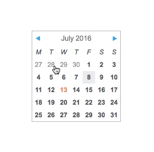

# DateJust.js

DateJust.js is a JavaScript component for **calendars**. It has **powerful controls:** drag to select multiple days, and scroll to change month.

- - -

- - -

- [Getting Started](#getting-started)
  - [Demo](#demo)
  - [Supported Browsers](#supported-browsers)
  - [Dependencies](#dependencies)
  - [To Run](#to-run)
  - [To Use](#to-use)
- [Configuration](#configuration)
  - [minDate](#mindate)
  - [maxDate](#maxdate)
  - [existingDate](#existingdate)
  - [existingDateRange](#existingdaterange)
  - [dragSelection](#dragselection)
  - [scrollControl](#scrollcontrol)
- [Callbacks](#callbacks)
  - [onDateSelected](#ondateselected)
  - [onDateRangeSelected](#ondaterangeselected)
- [Markup](#markup)
  - [Generated HTML](#generated-html)
  - [Conditional CSS Classes](#conditional-css-classes)
    - [todays-date](#todays-date)
    - [in-previous-month](#in-previous-month)
    - [in-this-month](#in-this-month)
    - [in-next-month](#in-next-month)
    - [active-day](#active-day)
    - [day-in-range](#day-in-range)
    - [disabled-date](#disabled-date)

## Getting Started

### Demo

A demo of the library in action can be [found here](http://www.callumhart.com/open-source/date-just).

### Supported Browsers

- Chrome :white_check_mark:
- Opera :white_check_mark:
- ~~Safari~~ known issues:
  - Left arrow facing right :point_left:
  - Scroll control isn't as smooth as other browsers
- ~~Firefox~~ known issues:
  - Drag control to select a date range is buggy.

### Dependencies

Nothing *(not even jQuery)*

### To Run

```
$ git clone git@github.com:callum-hart/DateJust.js.git
$ cd DateJust.js
$ npm install
$ grunt watch
```

### To Use

- Include [CSS](https://github.com/callum-hart/DateJust.js/blob/master/lib/css/date-just.min.css)
- Include [JavaScript](https://github.com/callum-hart/DateJust.js/blob/master/lib/js/date-just.min.js)
- Create an instance:

```javascript
var instance = new DateJust(element, { options });
```

> `element` can be a selector or a DOM element.

## Configuration

### minDate

- **Details** Minimum date the calendar can go to.
- **Type** `<Date>`
- **Default** `January 10 years in the past (from todays date)`
- **Usage** `minDate: new Date(2010, 5, 10)`

### maxDate

- **Details** Maximum date the calendar can go to.
- **Type** `<Date>`
- **Default** `January 10 years in the future (from todays date)`
- **Usage** `maxDate: new Date(2020, 5, 10)`

### existingDate

- **Details** Initialize the calendar with an active date.
- **Type** `<Date>`
- **Usage** `existingDate: new Date(2016, 11, 8)`

### existingDateRange

- **Details** Initialize the calendar with an active date range.
- **Type** `Array <Date>`
- **Usage** `existingDateRange: [new Date(2016, 11, 8), new Date(2016, 11, 25)]`

### dragSelection

- **Details** Allow drag control to select a date range.
- **Type** `Boolean`
- **Default** `true`
- **Usage** `dragSelection: false`

### scrollControl

- **Details** Allow scroll control to change the month.
- **Type** `Boolean`
- **Default** `true`
- **Usage** `scrollControl: false`

## Callbacks

### onDateSelected
`onDateSelected: (date) {}`

- **Details** When a date is selected.
- **Arguments** `(date)`

### onDateRangeSelected
`onDateRangeSelected: (startDate, endDate) {}`

- **Details** When a date range is selected.
- **Arguments** `(startDate, endDate)`
- **Condition** Option [`dragSelection`](#dragselection) has to be set to `true`.

## Markup

### Generated HTML

The HTML generated by DateJust.js is:

```html
<div class="dj-container">
  <div class="dj-header">
    <div class="dj-month">
      <span class="dj-month-name"></span>
      <select class="dj-month-select"></select>
    </div>
    <div class="dj-year">
      <span class="dj-year-name"></span>
      <select class="dj-year-select"></select>
    </div>
    <a href="" class="previous-month">&#9654;</a>
    <a href="" class="next-month">&#9654;</a>
  </div>
  <ul class="day-names">
    <li>M</li>
    <li>T</li>
    <li>W</li>
    <li>T</li>
    <li>F</li>
    <li>S</li>
    <li>S</li>
  </ul>
  <ul class="days">
    <li>
      <a href=""></a>
    </li>
  </ul>
</div>
```

### Conditional CSS Classes

Classes that are applied when a certain condition is true.

#### todays-date
`.todays-date`

- **Condition** Applied to todays date.
- **Element** `.dj-container ul.days a`

#### in-previous-month
`.in-previous-month`

- **Condition** Applied to dates in the previous month.
- **Element** `.dj-container ul.days a`

#### in-this-month
`.in-this-month`

- **Condition** Applied to dates in the active month.
- **Element** `.dj-container ul.days a`

#### in-next-month
`.in-next-month`

- **Condition** Applied to dates in the next month.
- **Element** `.dj-container ul.days a`

#### active-day
`.active-day`

- **Condition** Applied to the active date.
- **Element** `.dj-container ul.days a`

#### day-in-range
`.day-in-range`

- **Condition** Applied to active dates in a date range.
- **Element** `.dj-container ul.days a`

#### disabled-date
`.disabled-date`

- **Condition** Applied to dates out of the [`minDate`](#mindate) and [`maxDate`](#maxdate).
- **Element** `.dj-container ul.days a`

